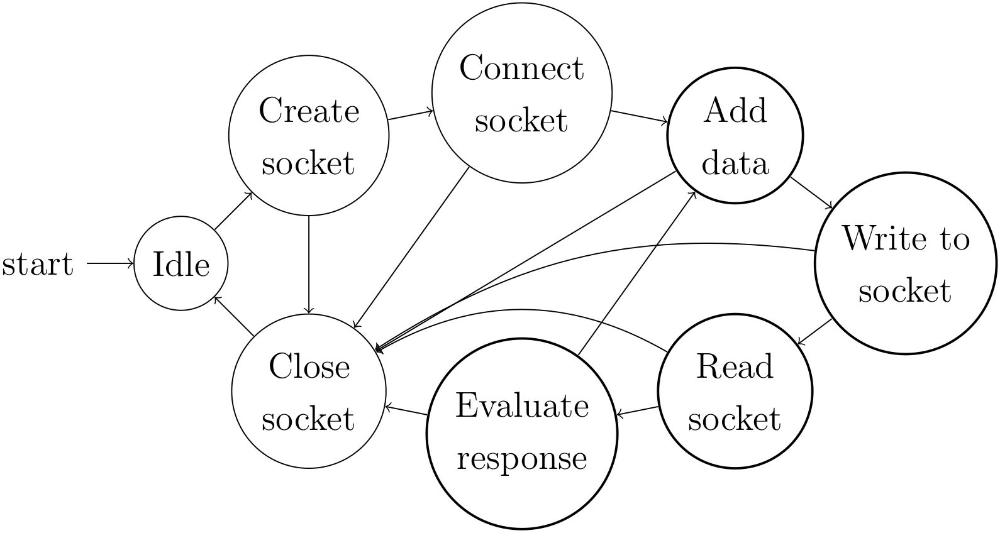

# Anemo UART forwarder and logger

Receives [Anemo embedded platform](https://bitbucket.org/AlexanderMarinsek/riot-anemo-simple/src/master/) data over UART, adds timestamp, stores data locally and sends it to the cloud platform. 

*Primarily indended for use with RPi and other Linux based devices.*

States composition example for the *request task*:



## Installation

Clone git repository.
```bash
git clone ...
```

Navigate to base and build.
```bash
make all
```

## Settings
Most of the important settings (cloud platform web address, default serial port...) can be found in `main.c`.

## Usage

Build the executable.
```bash
make all
```

Connect a pre-programmed [Anemo embedded platform](https://bitbucket.org/AlexanderMarinsek/riot-anemo-simple/src/master/) to one of the device's USB ports and run the application.

```bash
./bin/main
```
or
```bash
./bin/main </port/path>
```
